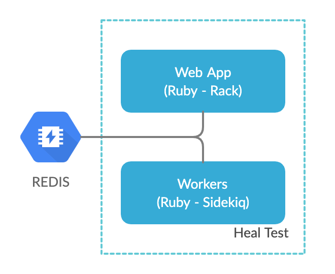

# Heal Test Application
The goal of this project is for you to demonstrate your ability to take a standard web application and generate the appropriate files (Docker/Terraform) required to deploy it in the cloud. In addition you should provide methodology, either in code or verbally, on how secret credentials such as database URLs can be retrieved from Vault or some other secret key store / mechanism and used securely inside the application.

The web application code is provided in this repository, and instructions can be found below on how to run the application locally. Once you have completed the deliverables listed below you can submit your solution for review via pull request, or email a .zip file to `anthony.persaud@heal.com`.



# Deliverables
Your successful completion of this test will include the following items:

1. A Dockerfile or docker-compose.yml that can be used to build a container of this Ruby application.
2. A Terraform configuration (https://www.terraform.io/) used to deploy the application.
4. A method for correctly and securely provisioning the MONGODB_URI and REDIS_URL environment variables. This could potentially use Hashicorp Vault.
5. A writeup describing your solution.

# Dependencies
1. Ruby 2.6 or later
3. REDIS Server -- url to be provided as the environment variable REDIS_URL

# Setup Running Locally
To run the application locally, you should have a version of Ruby installed on your system (>= 2.6). We recommend installing RVM: https://rvm.io . You can do so with the command below:

```
$ \curl -sSL https://get.rvm.io | bash -s stable
```

Once you have Ruby installed, you can install the application's dependencies:

```
$ gem install bundler puma foreman
$ bundle install
```

If you want to test with a local Redis instance, you can start one on port 6379:

```
$ brew install redis
$ brew services start redis
```

To start all services, you can use the following command:
```
$ bundle exec foreman start
```

To start each process individually, you can use the following commands:
```
# Web process
$ bundle exec puma -C config/puma.rb
# Worker process (Sidekiq)
$ bundle exec sidekiq start -r ./config/boot.rb -C ./config/sidekiq.yml
```
# Testing Running Locally
Once the application is running on the specific port, you can test enqueing an asynchronous task through the API endpoint `GET /`, and the Sidekiq process should pick up and perform the operation asynchronously.